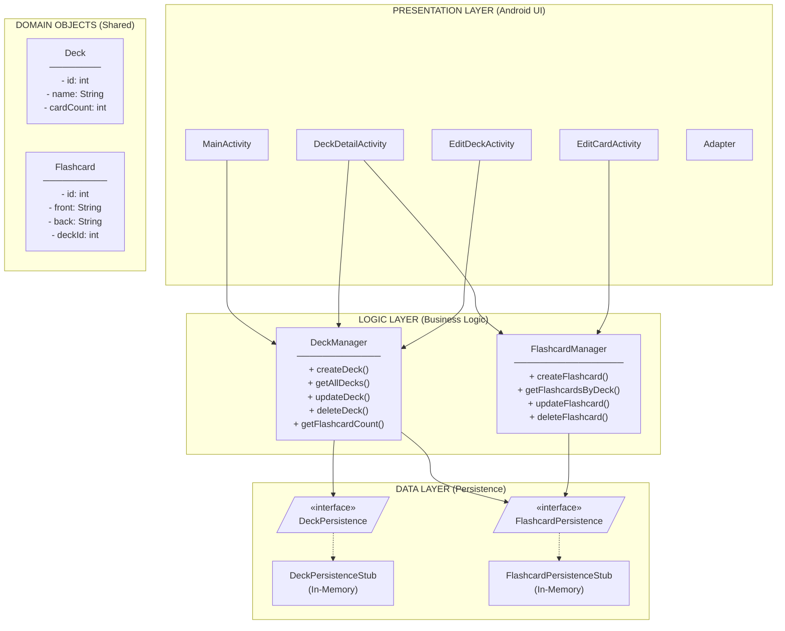
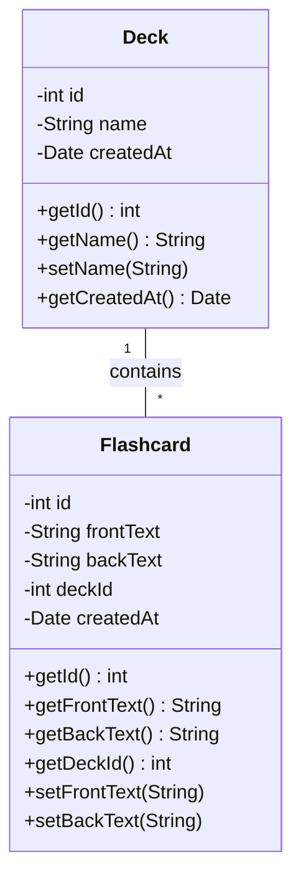

# Recallr (Flash Card Study App) - Architecture

## Overview

Recallr app follows a **three-tier layered architecture** that separates concerns into distinct layers: Presentation, Logic (Business), and Data. This architecture promotes testability, maintainability, and allows for future database implementations without affecting other layers.

## Architecture Diagram



### High-level overview of how components interact


### Domain Class Diagram



## Package Structure

```
app/src/main/java/comp3350/flashcard/
├── application/                    # Application configuration
│   └── Services.java               # Service locator / dependency injection
│
├── objects/                        # Domain objects (shared across layers)
│   ├── Deck.java
│   └── Flashcard.java
│
├── persistence/                    # Data layer
│   ├── DeckPersistence.java        # Interface
│   ├── FlashcardPersistence.java   # Interface
│   └── stubs/
│       ├── DeckPersistenceStub.java
│       └── FlashcardPersistenceStub.java
│
├── logic/                          # Business logic layer
│   ├── DeckManager.java
│   ├── FlashcardManager.java
│   └── StudySessionManager.java
│
└── presentation/                   # UI layer (Android Activities)
    ├── MainActivity.java
    ├── DeckDetailActivity.java
    ├── CardEditActivity.java
    └──  Adapter.java

app/src/test/java/comp3350/flashcard/
├── objects/                        # Domain object tests
│   ├── DeckTest.java
│   └── FlashcardTest.java
│
└── logic/                          # Logic layer tests
    ├── DeckManagerTest.java
    ├── FlashcardManagerTest.java
    └── StudySessionManagerTest.java
```

## Layer Responsibilities

### Presentation Layer (`presentation/`)
- Android Activities and Fragments
- Handles user input and displays data
- Calls Logic layer for all business operations
- Contains NO business logic or direct database access

### Logic Layer (`logic/`)
- Contains all business rules and validation
- Coordinates between Presentation and Data layers
- Manages application state (e.g., study session state)
- Does NOT depend on Android framework

### Data Layer (`persistence/`)
- Defines interfaces for data operations
- Stub implementations use in-memory collections
- Future: Real database implementations (HSQLDB, SQLite)
- Handles data serialization/deserialization

### Domain Objects (`objects/`)
- Plain Java objects representing core entities
- Shared across all layers
- No dependencies on any layer

## Component Interactions

### Creating a Flashcard (Example Flow)
```
1. User enters card text in EditCardActivity
2. EditCardActivity calls FlashcardManager.createFlashcard()
3. FlashcardManager validates input (non-empty text)
4. FlashcardManager calls FlashcardPersistence.insertFlashcard()
5. FlashcardPersistenceStub adds card to ArrayList
6. Success flows back up to UI
```

## Dependency Management

Dependencies flow downward only:
- Presentation → Logic → Data
- All layers can access Domain Objects

The `Services` class acts as a service locator, providing access to manager instances


## Stub Database Behavior

For Iteration 1:
- Data is stored in `ArrayList` collections
- **Persists while app is running** (data survives screen rotations, activity changes)
- **Resets to default data on app restart**
- Pre-populated with sample decks and cards for testing


