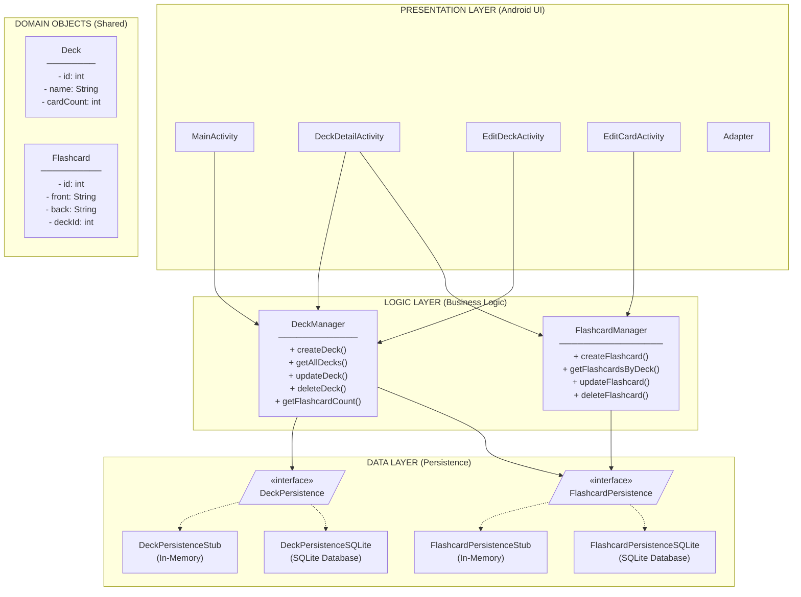
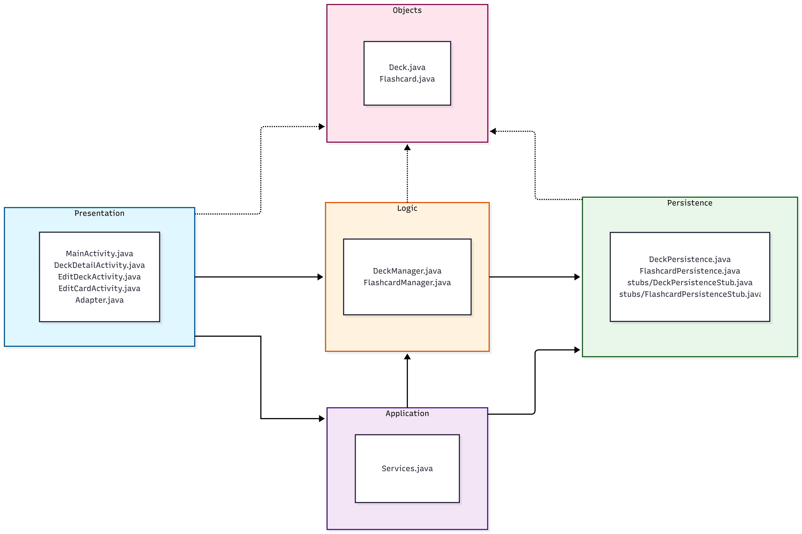
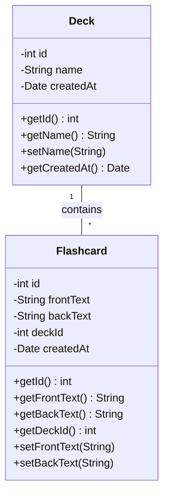

# Recallr (Flash Card Study App) - Architecture

## Overview

Recallr app follows a **three-tier layered architecture** that separates concerns into distinct layers: Presentation, Logic (Business), and Data. This architecture promotes testability, maintainability, and allows for future database implementations without affecting other layers.

## Architecture Diagram



### High-level overview of how components interact



### Domain Class Diagram



## Package Structure
This project enforces **strict separation of concerns**.
```
app/src/main/java/comp3350/flashcard/
├── application/                    # Application configuration
│   ├── FlashcardApplication.java   # Application class (sets up services)
│   └── Services.java               # Service locator / dependency injection
│
├── objects/                        # Domain objects (shared across layers)
│   ├── Deck.java
│   └── Flashcard.java
│
├── persistence/                    # Data layer
│   ├── DeckPersistence.java        # Interface
│   ├── FlashcardPersistence.java   # Interface
│   ├── PersistenceException.java   # Custom exception for persistence errors
│   ├── stubs/
│   │   ├── DeckPersistenceStub.java
│   │   └── FlashcardPersistenceStub.java
│   └── sqlite/
│       ├── DatabaseHelper.java
│       ├── DeckPersistenceSQLite.java
│       └── FlashcardPersistenceSQLite.java
│
├── logic/                          # Business logic layer
│   ├── DeckManager.java
│   ├── FlashcardManager.java
│   └── StudySessionManager.java
│
└── presentation/                   # UI layer (Android Activities)
    ├── MainActivity.java
    ├── DeckDetailActivity.java
    ├── EditDeckActivity.java
    ├── EditCardActivity.java
    └──  Adapter.java

app/src/test/java/comp3350/flashcard/
├── objects/                        # Domain object tests
│   ├── DeckTest.java
│   └── FlashcardTest.java
│
└── logic/                          # Logic layer tests
    ├── DeckManagerTest.java
    ├── FlashcardManagerTest.java
    └── StudySessionManagerTest.java

app/src/androidTest/java/comp3350/flashcard/
└── persistence/                    # Integration tests
    └── DataAccessTest.java
```

## Layer Responsibilities

### Presentation Layer (`presentation/`)
- Android Activities and Fragments
- Handles user input and displays data
- Calls Logic layer for all business operations
- Contains NO business logic or direct database access

### Logic Layer (`logic/`)
- Contains all business rules and validation
- Coordinates between Presentation and Data layers
- Manages application state (e.g., study session state)
- Does NOT depend on Android framework

### Data Layer (`persistence/`)
- Defines interfaces for data operations
- **Stub implementations** use in-memory collections (for testing)
- **SQLite implementations** use Android's built-in SQLite database (production)
- Handles data serialization/deserialization
- Uses dependency injection to switch between implementations

### Domain Objects (`objects/`)
- Plain Java objects representing core entities
- Shared across all layers
- No dependencies on any layer

## Component Interactions

### Creating a Flashcard (Example Flow)
```
1. User enters card text in EditCardActivity
2. EditCardActivity calls FlashcardManager.createFlashcard()
3. FlashcardManager validates input (non-empty text)
4. FlashcardManager calls FlashcardPersistence.insertFlashcard()
5. FlashcardPersistenceSQLite inserts card into database (or stub adds to ArrayList in tests)
6. New card with auto-generated ID is returned
7. Success flows back up to UI
```

## Dependency Management

Dependencies flow downward only:
- Presentation → Logic → Data
- All layers can access Domain Objects

The `Services` class acts as a service locator, providing access to manager instances.

### Automatic Persistence Selection
The application automatically selects the appropriate persistence implementation:
- **Production app** (Android context available) → Uses SQLite
- **Unit tests** (no Android context) → Uses stubs
- **Integration tests** (test context available) → Uses SQLite

This is achieved through dependency injection in the `Services` class, which checks for Android context availability. No code changes are required to switch between implementations.


## Database Persistence

### SQLite Implementation (Production)
**Used in:** Production app, Integration tests

**Database:** `flashcard.db` stored in app's private storage

**Schema:**
- `decks` table: id, name, description, created_at, last_studied_at
- `flashcards` table: id, front, back, deck_id, created_at
- Foreign key constraint with CASCADE DELETE (deleting deck deletes all its flashcards)
- Index on `deck_id` for faster queries
- UNIQUE constraint on deck names

**Behavior:**
- Data persists across app restarts
- Database survives app updates (upgrade handled by `onUpgrade()`)
- Pre-populated with 3 sample decks and 7 flashcards on first launch
- Located in: `/data/data/comp3350.flashcard/databases/flashcard.db`

**Sample Data:**
- Spanish Vocabulary (3 cards)
- Java Basics (2 cards)
- World Capitals (2 cards)

### Stub Implementation (Testing)
**Used in:** Unit tests

**Behavior:**
- Data stored in `ArrayList` collections (in-memory)
- Persists while app is running (survives screen rotations, activity changes)
- Resets to default data on app restart
- Same sample data as SQLite for consistency
- Faster execution for unit tests

## Testing Strategy

### Unit Tests (`app/src/test/`)
- Test business logic in isolation
- Use stub persistence (no database)
- Fast execution
- Run with: `./gradlew test`
- Target: >80% code coverage for logic layer

### Integration Tests (`app/src/androidTest/`)
- Test across architectural seams (Logic → Persistence)
- Use real SQLite database
- Fresh database for each test
- Run with: `./gradlew connectedAndroidTest`
- Coverage: All CRUD operations, cascade deletes, constraints


