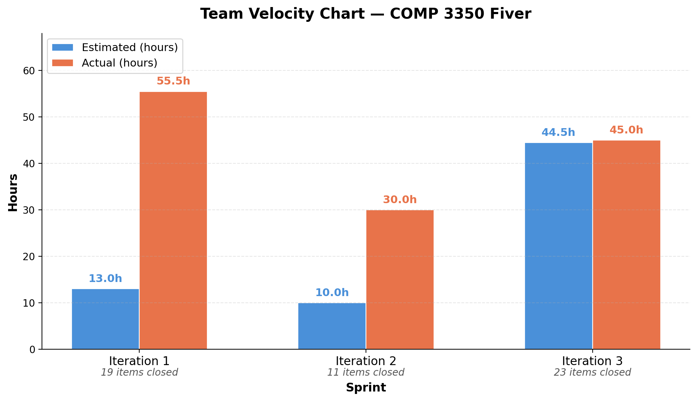

# A01-G05-Fiver: Final Retrospective

## Meaningful Weakness: Scattered Validation Logic and Poor Encapsulation

The most significant weakness identified across our iterations was the inconsistent placement of validation logic and poor domain object encapsulation. Beginning in Iteration One, validation rules for Flashcard and Deck objects were spread across multiple layers of the application, appearing in domain objects, the logic layer, and even the presentation layer rather than being centralized in a dedicated location. Domain objects exposed fields that should have been managed internally, violating encapsulation principles, as pointed out by the post-iteration-one review we received (Issue #47). We were still learning the different principles and ideas behind effective programming practices, as well as trying to figure out how to approach our project and program in a group setting. Our start wasn’t the greatest, but there was still plenty of time to improve.

In iteration two, more files were added to the logic layer. Classes and an interface for managing a study session, following the separation of concerns principle. The commenting style was made cleaner and more consistent. An exception, DeckValidationException.java, was also added, improving testing and usability. Although the management of the logic had improved, the issue of the scattered logic that had been brought up at the end of iteration one did not get resolved in iteration two. Another issue present in iteration one, noted in the graded feedback but not resolved, was that the domain objects had fields that should have been managed internally but weren’t. Both of these issues had been known about since the end of iteration one but hadn’t been fixed. Refactoring would take time, and we needed to focus on getting the features completed before dealing with the technical debt and getting rid of the code smells, so we made some issues to keep track of it for later (Issue #50).

## Corrective Actions Taken

Once Iteration Three provided dedicated time for refactoring, the team took the following concrete steps:

- Centralized validation into a dedicated folder. A validation/ package was created within the logic layer, containing separate validation classes for Flashcard and Deck. This ensures that all validation rules live in a single, discoverable location and can be modified or replaced independently of other logic.
- Restored encapsulation in domain objects. Fields that were previously publicly accessible or improperly mutated externally were refactored to be managed internally. This corrected the encapsulation violations noted in the graded feedback.
- Introduced package-private constructors and factory methods. Both Flashcard and Deck had their constructors made package-private, and static factory methods were introduced. This hides instantiation logic from callers, enforces construction rules at a single point, and eliminates the need for consumers to understand the internal state setup of these objects.
- Expanded dependency injection infrastructure. Additional interfaces and classes were introduced to the logic layer to properly support dependency injection, further decoupling components and improving testability.
- Tracked all deferred debt with issues. During Iteration Two, the team created tracked issues (e.g., Issue #50, Issue #69) to ensure nothing was forgotten, which enabled a systematic approach to resolution in Iteration Three.

## Measurable Evidence of Improvement

- Validation logic is now fully contained within the validation/ package — zero validation code remains in domain objects or the presentation layer.
- All fields in Flashcard and Deck that were previously exposed are now managed internally, with access controlled through methods.
- Factory method adoption required updates to the majority of files in the codebase, demonstrating the breadth of the original issue and the thoroughness of the fix.
- DeckValidationException, introduced in Iteration Two, is now properly leveraged through the centralized validation layer rather than being used inconsistently.
- The post-Iteration One review issues and graded feedback items related to logic scattering and encapsulation are fully resolved.

### Architectural Metrics

| Metric | Iteration 2 | Iteration 3 | Issues/Commits |
|--------|-------------|-------------|-------------|
| **SOLID Violations** | 15+ identified issues | 0 critical violations | [Issue #50](https://code.cs.umanitoba.ca/comp3350-winter2026/a01-g05-fiver/-/issues/50) |
| **Code Duplication** | Validation logic in 3 layers (8+ files) | Single validator classes | [Commit](https://code.cs.umanitoba.ca/comp3350-winter2026/a01-g05-fiver/-/commit/d52a20196731fbcd15e01f758f190c938a32f7d6)|
| **Magic Numbers** | 12+ hard-coded values | All constants centralized | [Commit](https://code.cs.umanitoba.ca/comp3350-winter2026/a01-g05-fiver/-/commit/4cca4b1bd2ba1429492e569810e25823931bcaee) |
| **Public Setters for Immutable Properties** | 6 violations (setId, setCreatedAt) | 0 violations | [Issue #64](https://code.cs.umanitoba.ca/comp3350-winter2026/a01-g05-fiver/-/issues/64) [Commit](https://code.cs.umanitoba.ca/comp3350-winter2026/a01-g05-fiver/-/commit/23242e9220512d9c06e5c1686ed8eaf48aa224ec) |
| **Factory method adoption** | Domain objects had fields that should have been managed internally |Introduced package-private constructors and factory methods | [Commit](https://code.cs.umanitoba.ca/comp3350-winter2026/a01-g05-fiver/-/blob/main/Documents/RETROSPECTIVE.md?ref_type=heads) |

## Velocity Chart: Three Iterations
